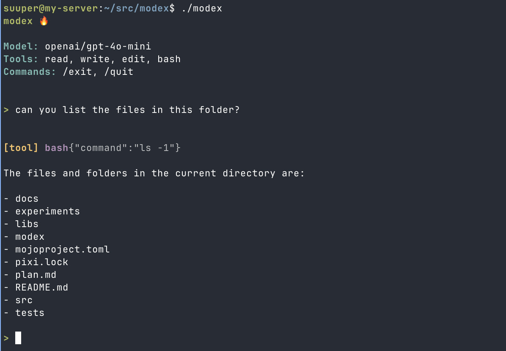

# modex 🔥

A Mojo-based AI coding harness — a terminal coding agent inspired by
[pi](https://github.com/badlogic/pi-mono/tree/main/packages/coding-agent).



## Prerequisites

- **Linux x86_64** (other platforms: adjust `platforms` in
  `mojoproject.toml`)
- **curl** and **bash** (for pixi installer)

## Setup

### 1. Install pixi

[pixi](https://pixi.sh) is the package manager used to install and manage
Mojo.

```bash
curl -fsSL https://pixi.sh/install.sh | bash
```

Then restart your shell or run:

```bash
source ~/.bashrc
```

Verify:

```bash
pixi --version
```

### 2. Clone and install dependencies

```bash
git clone <repo-url> modex
cd modex
pixi install
```

This downloads Mojo nightly and all dependencies into the project's
`.pixi/` directory. Nothing is installed globally — everything is
self-contained.

### 3. Verify Mojo works

```bash
pixi run mojo --version
```

You should see something like:

```
Mojo 0.26.x.x.dev... (nightly)
```

## Development

### Run

Set your OpenRouter API key as an environment variable:

```bash
export OPENROUTER_API_KEY=sk-or-...
```

```bash
pixi run run
```

### Build

```bash
pixi run build
```

Produces a `./modex` binary.

### Test

```bash
pixi run test
```

This runs the lightweight Mojo test runner in `tests/main.mojo`.

### Run Mojo commands directly

Use `pixi run` to run any Mojo command inside the environment:

```bash
pixi run mojo run src/main.mojo
pixi run mojo build src/main.mojo -o modex
pixi run mojo repl
```

### Enter the pixi shell

To get a shell with Mojo on your PATH (so you can run `mojo` directly
without `pixi run`):

```bash
pixi shell
mojo --version
mojo repl
```

## Project structure

```
modex/
├── mojoproject.toml          # Project config, dependencies, tasks
├── docs/                     # Plans, specs and other docs
├── src/
│   └── main.mojo             # Entry point (imports from libs/)
├── libs/                     # Reusable Mojo packages (each extractable)
│   ├── http_client/          # Native HTTP/HTTPS client over libc + OpenSSL
│   │   ├── __init__.mojo     # Package exports
│   │   ├── chunked.mojo      # Shared chunked transfer decoding
│   │   ├── client.mojo       # HttpClient high-level API + SSE fetch helpers
│   │   ├── net.mojo          # Low-level socket FFI bindings
│   │   ├── response.mojo     # HTTP response parser
│   │   └── tls.mojo          # OpenSSL TLS socket
│   ├── sse/                  # Incremental Server-Sent Events parser
│   │   ├── __init__.mojo
│   │   └── parser.mojo
│   ├── json/                 # Native JSON parser + serializer
│   │   ├── __init__.mojo
│   │   ├── parser.mojo
│   │   ├── value.mojo
│   │   └── serializer.mojo
│   ├── llm/                  # LLM provider clients + shared history/types
│   │   ├── __init__.mojo
│   │   ├── history.mojo      # SessionHistory / SessionMessage
│   │   ├── openrouter.mojo   # OpenRouter streaming + tool loops
│   │   └── types.mojo        # Shared provider structs
│   ├── style/                # Minimal ANSI styling helpers for CLI output
│   └── tools/                # Built-in tool definitions + execution
├── experiments/              # Standalone experiments
├── tests/                    # Lightweight test runner + test modules
└── README.md                 # This file
```

## License

MIT
